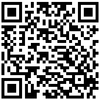
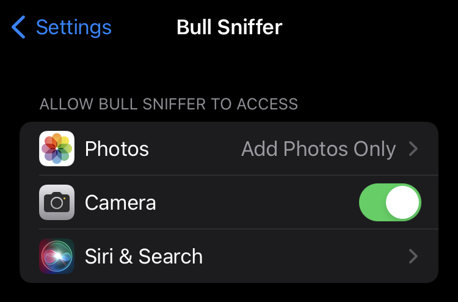

# 💩 BULL SNIFFER

1. [What is this app?](#what)
2. [Screenshots](#screenshots)
3. [Download information](#download)
4. [The privacy policy](#privacy)
5. [Some legal disclaimers](#privacy)
6. [A note on copyleft](#copyleft)

## <a name="what">What is this app?</a>
This app measures bulls--t. I'll explain more below.

***MEASURE B.S. SCIENTIFICALLY***

Do you ever think to yourself: "darn, I wish there was a way to safely and securely measure BS scientifically from the safety of my Apple device"?

If yes, then think no more! With the Bull Sniffer, it is possible to do just that! Simply:
* 📲 Open your device
* 📷 Open the Bull Sniffing app, and point the camera at the suspected source of BS
* 🔬 Enjoy the results

And that's it! Once you've successfully scanned the suspected source of BS, the app will use its highly-scientific scanning software to measure the quantity of BS emanating from this source. The results of this measurement will be displayed an exact percentage point and a caption (the percentage point gives you the raw data; the caption tells you the significance of that data). You can save the resulting photo for your later amusement. See screenshots for more details.

Use responsibly and sniff safely!

**TL;DR:** This is an app for iPhone or iPad that measures BS scientifically. Simply point your iPhone at the suspected source of BS, and the app will scan it and determine how much BS is present as an exact percentage point. It will also provide a relevant caption to help the user gauge the significance of this measurement.

## <a name="screenshots">Screenshots</a>
Some of you may wish to see screen-caps of this app to know what you are dealing with. Your prayers have been heard. The screen-caps are below.

*Screen-cap of the Bull Sniffer being used at a halloween party:* [^1]

*Screen-cap of a monkey using the Bull Sniffer for the purposes of political commentary:* [^2]

*Screen-cap of a man sharing a tender moment with the Bull Sniffer:* [^3]

At first glance, the captions in these screenshots might not seem immediately connected to the BS levels being detected by the Bull Sniffer's sensors. But recall that these captions are meant to express the *qualitative* side of BS: it expresses how the BS *feels*. For instance, in the picture of the monkey the high BS rating tracks the amount of BS the monkey sees in modern society (or the modern meat industry in particular). And in the third photo, the relatively low BS rating tracks the man's relative certainty about his feelings. He is 73% percent sure that he *does* in fact love you (with the remaining 27% is being picked up by the BS detector). With some practice and a little patience, one will start to understand the relationship between the quantitive and the qualitiative side of BS (i.e. the relationship that exists between the percentage points and the captions).

For those interested, screen-caps or promotional photos for your particular Apple device can be found on the App store. All screen-caps or promotional photos are stored in the [AppStoreAssets](./AppStoreAssets/) folder.

## <a name="download">Download information</a>
If you have are currently viewing this document from your iPhone or iPad, you can download the Bull Sniffer by following this link: <https://apps.apple.com/ca/app/bull-sniffer/id6471924918>

If you are currently viewing this document from your computer, you can download the Bull Sniffer by opening your iPad/iPhone's camera and pointing it at this QR code:

## <a name="privacy">Privacy policy</a>

The Bull Sniffer requires the following permissions:
* Permission to access your device's camera
* Permission to save images to the camera roll
* Permission to add photos

Since the Bull Sniffer is essentially a camera/photo editing app, these permissions are necessary for the app's proper functioning. These permissions are only exercised if one of the following conditions are met:
* The user is feeding a camera roll image into the app in order to scan it for bull
* The user is currently accessing the Bull Sniffers internal camera view
* The user saves a photo to their photo library using the Bull Sniffer's user interface

In all cases these permissions are only exercised at the initiation of the user.

These are the permissions that the Bull Sniffer is ***not*** asking for:
* The Bull Sniffer is ***not*** asking for full access to the users photo library. Permissions to photos are given on a case-by-case basis; only when the user decides to feed a given photo into the Bull Sniffer will the app have access to that photo.
* The Bull Sniffer is **not** asking for access to the users microphone. Because the Bull Sniffer scans photos, not videos, there is no need access to the device microphone.

This is what the Bull Sniffer's permissions should look like in `Settings > Bull Sniffer`:

The Bull Sniffer does not collect any data about users or their app usage. More specifically:
* The Bull Sniffer does not collect any third-party analytics
* The Bull Sniffer does not include any third-party advertising and the app contains no ads
* The Bull Sniffer does not share any data with third-parties
* The Bull Sniffer does not collect any user or device data of any other kind

Because the Bull Sniffer does not collect any user or device data, it has no servers to host user or device data. All of the data produced by the Bull Sniffer (i.e. the photos it makes) is stored on the users local device, the user's iCloud, or both. That data is then treated according the the relevant privacy policies defined by Apple or Apple iCloud.

## <a name="disclaimer">Legal disclaimers</a>
* 💩 This app does not ***literally*** detect BS
* 🧪 Strictly speaking, this app is not "scientific"
* 🧬 Strictly speaking, this app's measurement software is not "highly technical"
* 👩‍⚕️ This app is not a replacement for the advice of a qualified medical professional
* 🎰 Do not use this app while operating heavy machinery
* 🚗 Do not use this app while operating a motor vehicle
* 🛸 Do not use this app to start a multi-decade UFO/UAP crash retrieval + reverse engineering program
* 📜 This app comes with absolutely ***NO*** warranty

## <a name="copyleft">A note on copyright (and/or copyleft)</a>
The software for the app can be found in the [App](./App/) directory. The images used for the App Store listing can be found in the [AppStoreAssets](./AppStoreAssets/) directory.

The software is free software and is licensed under the [GNU Afferno General Public License](./LICENSE.txt). The images used for the App Store listing are modifications of images in the Creative Commons, retrieved via WikiMedia. Proper attribution is provided at the bottom left of each photo or in the footnotes below.

[^1]: Original picture from Infrogmation of New Orleans, CC BY-SA 4.0 <https://creativecommons.org/licenses/by-sa/4.0>, via Wikimedia Commons
[^2]: The original picture is a self-portrait by the depicted Macaca nigra female. Public domain, via Wikimedia Commons
[^3]: Original picture from Tahirshah999, CC BY-SA 4.0 <https://creativecommons.org/licenses/by-sa/4.0>, via Wikimedia Commons
