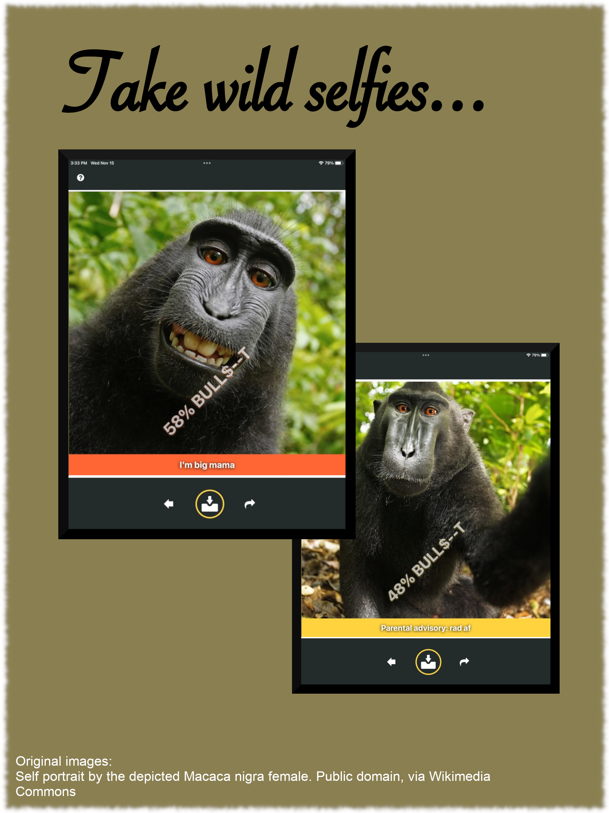

### 💩 BULL SNIFFER 💩

## What is this app?
This app measures bulls--t. I'll explain more below.

# A brief, no bulls--t description
This is an iPhone app that measures BS scientifically. Simply point your iPhone at the suspected source of BS, and the app will scan it and determine how much BS is present as an exact percentage point. It will also provide a relevant caption to help the user gauge the significance of this measurement.

# A flashier description
💩🔬 MEASURE B.S. SCIENTIFICALLY 🔬💩 

Do you ever think to yourself: "darn, I wish there was a way to safely and securely measure BS scientifically from the safety of my Apple device"?

If yes, then think no more! With the Bull Sniffer, it is possible to do just that! Simply:
• 📲 Open your device
• 📷 Open the Bull Sniffing app, and point the camera at the suspected source of BS
• 🔬 Enjoy the results

And that's it! Once you've successfully scanned the suspected source of BS, the app will use its highly-scientific scanning software to measure the quantity of BS emanating from this source. The results of this measurement will be displayed an exact percentage point and a caption (the percentage point gives you the raw data; the caption tells you the significance of that data). You can save the resulting photo for your later amusement. See screenshots for more details.

Use responsibly and sniff safely!

## Screencaps
Some of you may wish to see screen-caps of this app to know what you are dealing with. Your prayers have been heard. The screen-caps are below:

# A handsome monkey
This monkey is an avid user of the app, as you can see from the pictures below.

# A handsome man
The screen-caps below depict a handsome man sharing a tender moment on the bull-sniffer

# And more
Consider downloading the app for yourself if you'd like to see more!

## Legal disclaimers
• 💩 This app does not ***literally*** detect BS
• 🧪 Strictly speaking, this app is not "scientific"
• 🧬 Strictly speaking, this app's measurement software is not "highly technical"
• 👩‍⚕️ This app is not a replacement for the advice of a qualified medical professional
• 🎰 Do not use this app while operating heavy machinery
• 🚗 Do not use this app while operating a motor vehicle
• 🛸 Do not use this app to start a multi-decade UFO/UAP crash retrieval + reverse engineering program
• 📜 This app comes with absolutely ***NO*** warranty

## A note on licensing
The software for the app can be found in the [App](./App/) directory. The images used for the App Store listing can be found in the [AppStoreAssets](./AppStoreAssets/) directory. The software is free software and is licensed under the GNU Afferno General Public License (see (LICENSE.txt)[LICENSE.txt] for more info). The images used for the App Store listing are modifications of images in the Creative Commons, retrieved via WikiMedia. Proper attribution is provided at the bottom left of each photo.
